<h1 align="center">Hi 👋, I'm Shahriar Rahman Refat</h1>
<h3 align="center">A passionate web developer from Bangladesha</h3>

  

## 👨‍💻 About Me

I am **Shahriar Rahman Refat**, an aspiring **MERN Stack Developer** with a strong focus on building clean, responsive, and user-centric web applications. I am committed to continuous learning and dedicated to developing scalable solutions using modern JavaScript technologies.

I enjoy working across both frontend and backend, writing efficient code, and following best practices to deliver high-quality projects. My long-term goal is to grow as a full-stack developer and pursue advanced studies in technology.

**Core Interests**
- Frontend development with modern UI principles  
- Backend API design and RESTful architecture  
- Clean code, performance optimization, and best practices  
- Real-world project development and problem-solving  

**Currently focusing on:** React, Node.js, Express, MongoDB  
**Professional goal:** Full-stack MERN Developer  

## 🌐 Socials & Contact:
    

## 💻 Tech Stack

| Category | Technologies |
|--------|-------------|
| 🎨 **Frontend** |           |
| ⚙️ **Backend** |      |
| 🛠️ **Tools & Design** |        |
| 🚀 **Deployment & Hosting** |   |

## 📊 GITHUB STATISTICS & ANALYSIS:

### GitHub Contributions:  

  

## 📊 GitHub Statistics

<table>
  <tr>
    <td align="center">
      
    </td>
    <td align="center">
      
    </td>
  </tr>
</table>

---

## 🔥 Repository Stats & Streak

<table>
  <tr>
    <td align="center">
      
    </td>
    <td align="center">
      
    </td>
  </tr>
</table>

## 🏆 GitHub Trophies

## ✍️ Random Dev Quote

