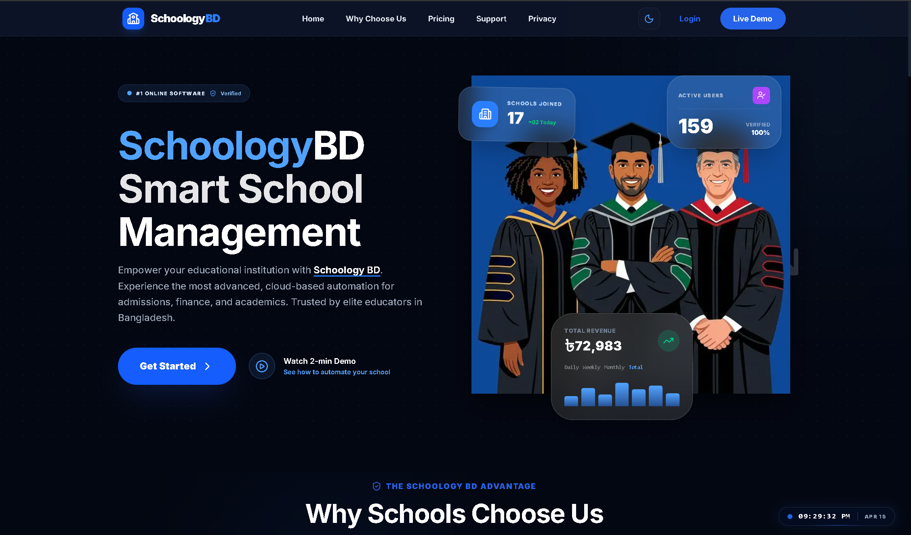

<h1 align="center">Hi 👋, I'm Shahriar Rahman Refat</h1>
<h3 align="center">A passionate MERN Stack Developer from Bangladesh</h3>

  

---

## 👨‍💻 About Me

I am **Shahriar Rahman Refat**, an aspiring **MERN Stack Developer** with a strong focus on building clean, responsive, and user-centric web applications. I am committed to continuous learning and dedicated to developing scalable solutions using modern JavaScript technologies.

I enjoy working across both frontend and backend, writing efficient code, and following best practices to deliver high-quality projects. My long-term goal is to grow as a full-stack developer and pursue advanced studies in technology.

**Core Interests:**
- 🎨 Frontend development with modern UI principles  
- ⚙️ Backend API design and RESTful architecture  
- 🧹 Clean code, performance optimization, and best practices  
- 💡 Real-world project development and problem-solving  

**Currently focusing on:** React, Node.js, Express, MongoDB, PostgreSQL, AI-integration   
**Professional goal:** Full-stack MERN Developer  

---

## 🌐 Connect With Me

  

---

## 💻 Tech Stack:

| Category | Technologies |
|----------|-------------|
| **Programming Languages** |   |
| **Frontend Development** |         |
| **Backend Development** |     |
| **Payment Integration** |   |
| **Databases & ORM / ODM** |      |
| **DevOps & Deployment** |    |
| **Tools & Platforms** |        |

---

## 🚀 Featured Projects

---

### 🟢 Schoology BD – School Management SaaS

<table>
<tr>
<td width="50%">

</td>
<td width="50%">

**Multi-tenant School Management System**

A scalable SaaS platform where multiple schools can manage their operations independently with secure role-based dashboards.

**Core Features:**
- Multi-school (multi-tenant) architecture  
- 6 Role-based dashboards (Admin, Principal, Teacher, Student, Parent, Accountant)  
- Secure authentication with Supabase  
- Academic, financial & administrative management  

**Tech Stack:**  
Next.js, TypeScript, Supabase, PostgreSQL, Prisma, Tailwind CSS  

🔗 [Live App](https://school-management-ruby-omega.vercel.app/) | [Repo](https://github.com/ShahriarRefat0/School-management.git)

</td>
</tr>
</table>

---

### 🔵 Book2Door – Book Delivery Platform

<table>
<tr>
<td width="50%">

**Online Book Delivery System**

A full-stack web application that allows users to browse, order, and manage books with secure authentication and role-based dashboards.

**Core Features:**
- Role-based dashboards (Admin, Librarian, Customer)  
- Secure authentication & authorization  
- Book browsing & order management  
- Payment integration system  

**Tech Stack:**  
React.js, Node.js, Express.js, MongoDB, Firebase, JWT, Stripe  

🔗 [Client](https://github.com/ShahriarRefat0/Book2Door-client.git) | [Repo](https://book2-door-client.vercel.app/)

</td>
<td width="50%">

</td>
</tr>
</table>

---

## 📊 GitHub Statistics

### 🔥 Contribution Streak & 📈 GitHub Stats

  
  

  

### 📊 Detailed Contribution Analysis

<table>
<tr>
<td width="50%">

</td>
<td width="50%">

</td>
</tr>
</table>

 

  

  
   
  

---

## ✍️ Random Dev Quote

  

---

  

  
### 💙 Thanks for visiting! Feel free to connect and collaborate!
  

